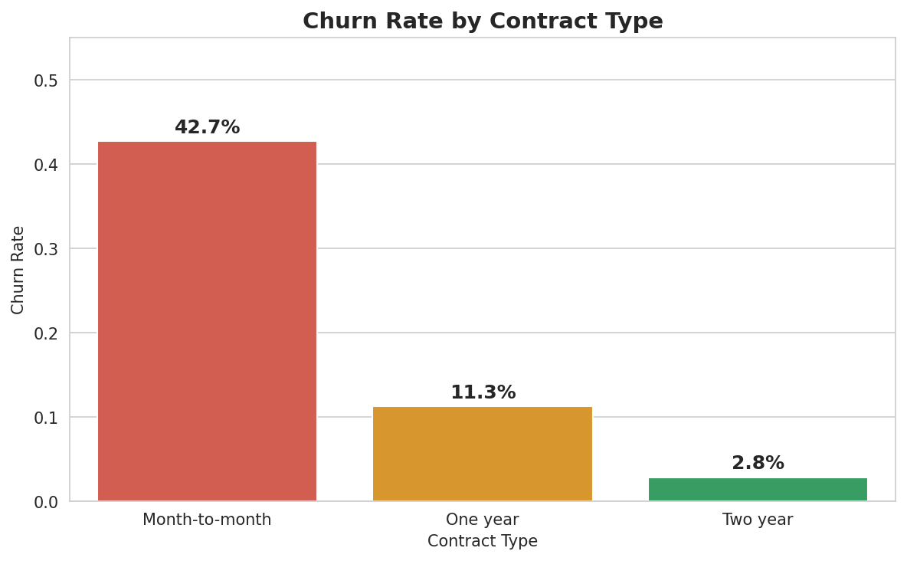
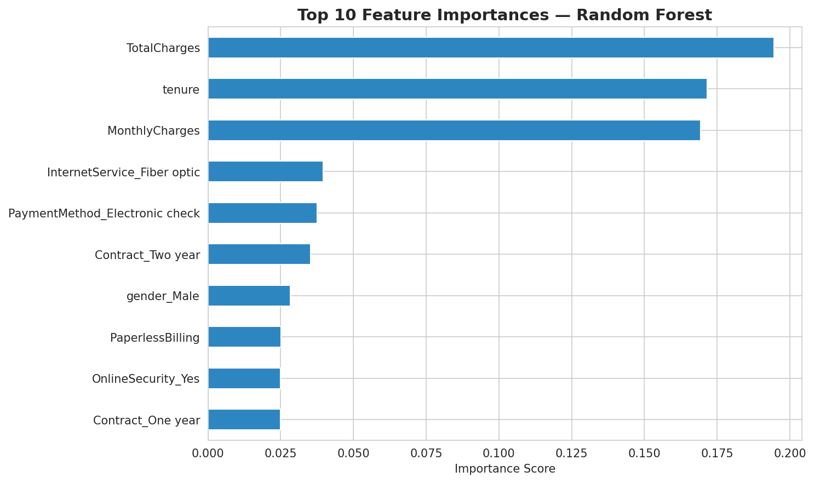
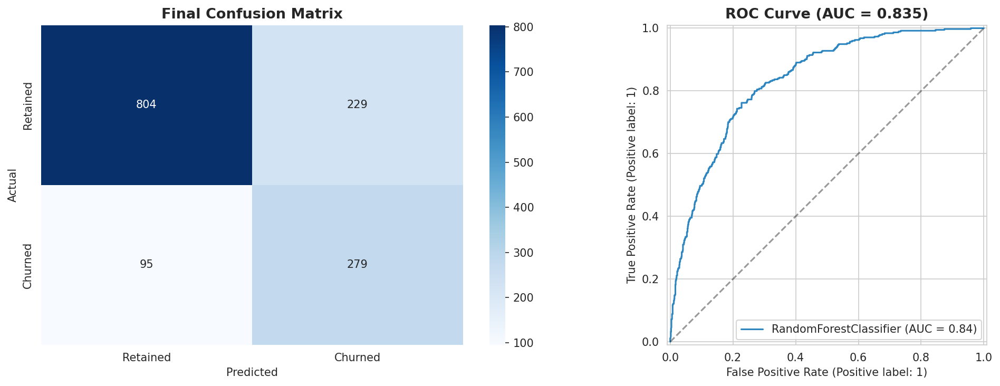

# 📉 Telco Customer Churn Prediction

> Predicting which telecom customers are likely to cancel their subscription using machine learning — enabling targeted retention campaigns.

## 🎯 Business Problem

Customer churn costs telecom companies significant revenue every year. This project identifies at-risk customers before they leave, so the business can intervene with personalised retention offers — before they cancel their subscription.

## 📊 Dataset

- **Source:** IBM Telco Customer Churn — [Kaggle](https://www.kaggle.com/datasets/blastchar/telco-customer-churn)
- **Size:** 7,043 customers · 21 features
- **Target variable:** Churn (Yes/No) — approximately 26.5% positive class

## 🔧 Approach

| Step | Details |
|---|---|
| Data Cleaning | Fixed `TotalCharges` data type, dropped 11 null rows (0.15% of data) |
| EDA | Analysed churn patterns by contract type, tenure, monthly charges, internet service, and payment method |
| Feature Engineering | Binary encoding, one-hot encoding for categorical variables, StandardScaler for numerical features |
| Modelling | Compared Logistic Regression, Random Forest, and XGBoost |
| Class Imbalance | Applied `class_weight='balanced'` to improve minority class detection |
| Evaluation | Confusion matrix, ROC-AUC, Precision, Recall, F1-score |
| Tuning | 5-fold cross-validation + RandomizedSearchCV for hyperparameter optimisation |

## 📈 Results

| Model | ROC-AUC | F1 (Churn) | Recall (Churn) |
|---|---|---|---|
| Logistic Regression | 0.836 | 0.609 | 0.575 |
| Random Forest | 0.817 | 0.545 | 0.487 |
| **Random Forest (Tuned)** | **0.835** | **0.63** | **0.75** |

## 💡 Key Business Insights

**1. Month-to-month contracts are the #1 churn driver**
Customers on month-to-month contracts churn at ~42% vs ~3% on two-year contracts.
*Recommendation: Offer incentives to upgrade customers to longer contracts.*

**2. New customers are the most vulnerable**
Customers with ≤12 months tenure churn at a substantially higher rate than long-tenured customers.
*Recommendation: Implement a 90-day early engagement programme for new customers.*

**3. High monthly charges drive dissatisfaction**
Customers paying above $65/month churn more than lower-paying customers.
*Recommendation: Introduce a loyalty discount tier for high-paying, long-tenure customers.*

**4. Fibre optic customers need attention**
Fibre optic customers churn at ~42% vs ~19% for DSL — despite paying more.
*Recommendation: Investigate service quality issues in fibre optic delivery.*

**5. Electronic check users are high risk**
Electronic check payment customers churn at ~45% — the highest rate of any payment method.
*Recommendation: Incentivise auto-payment setup with a small monthly discount.*

## 📊 Visualisations

### Churn Rate by Contract Type


### Top 10 Feature Importances


### Final Model Evaluation


## 🛠️ Tech Stack

Python · Pandas · NumPy · Matplotlib · Seaborn · Scikit-learn · XGBoost

## 🚀 How to Run

1. Clone the repository:
```bash
git clone https://github.com/Unplugged14/telco-churn-prediction.git
```

2. Open `Telco_Churn_Prediction.ipynb` in Google Colab or Jupyter Notebook

3. Run all cells from top to bottom

## 📁 Repository Structure

```
telco-churn-prediction/
├── .gitignore
├── README.md
├── Telco_Churn_Prediction_Final.ipynb   # Main analysis notebook
├── churn_by_contract.png                 # EDA visualisation
├── churn_by_service_payment.png          # EDA visualisation
├── correlation_heatmap.png               # EDA visualisation
├── feature_importance.png                # Model insight
├── final_evaluation.png                  # Model evaluation
├── monthly_charges_churn.png              # EDA visualisation
└── tenure_churn.png                       # EDA visualisation
```

## 📝 Limitations and Next Steps

- Model trained on a static snapshot — retraining quarterly would maintain accuracy over time
- Adding behavioural features (support call frequency, usage trends) could improve predictive power
- A cost-benefit analysis should weigh false positive costs (wasted retention spend) against false negative costs (lost revenue from missed churners)

---

*Built as part of an independent data science practice.*
